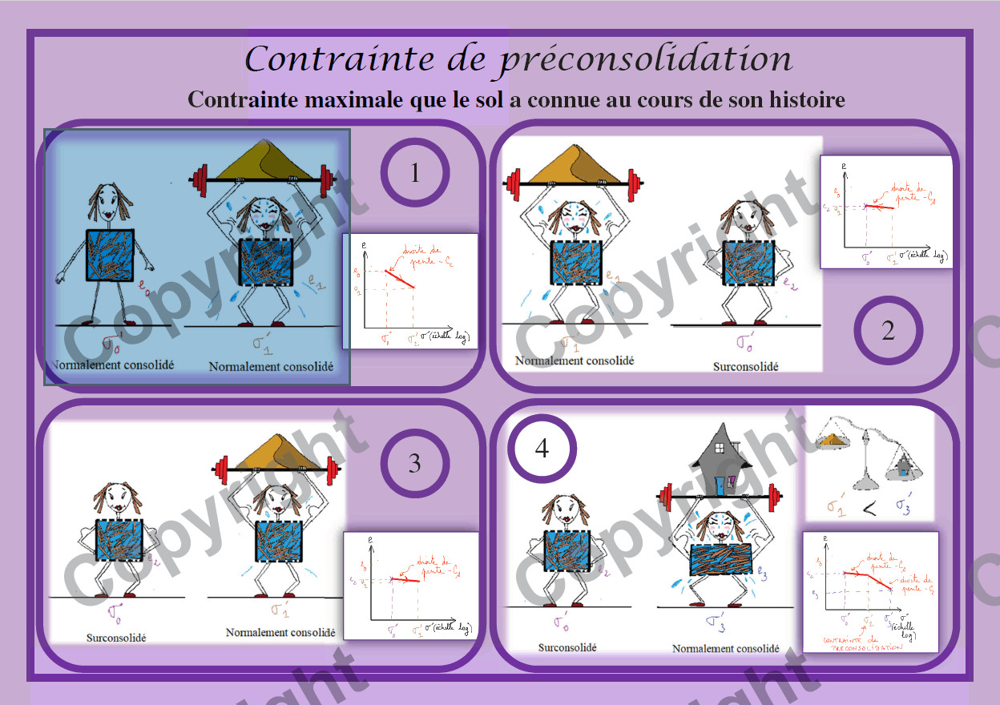

# Module Bases de la Géotechnique

## Contexte et objectifs  

Le DUT avait pour objectif de former en quatre semestres des techniciens supérieurs dotés de fortes compétences technologiques, mais également familiers des aspects non technologiques de la  profession, comme la gestion de projets. Le programme de cette formation était régi par un **Programme Pédagogique National (PPN) Génie Civil - Construction Durable**, définissant notamment les **compétences** que les étudiants devaient acquérir. La formation était scindée en Unités d'Enseignement, elles-mêmes scindées en modules et pour chaque module, le PPN définissait un nombre d'heures allouées pour atteindre les objectifs fixés.  

Je m'attarderai ici sur le module **Bases de la géotechnique**, destiné aux étudiants de Semestre 3 (début de deuxième année), monté pour répondre aux critères du **PPN 2013**.  

**Objectif du module** Comprendre une campagne de reconnaissance. Calculs des tassements pour des ouvrages simples.  

**Compétences visées**
* Etre capable de contrôler la conformité des opérations de reconnaissance des sols, sous-sols (mesures, analyses géotechniques,...)
* Etablir et formaliser les résultats d'analyses et de mesures par des rapports, comptes rendus, publications
* Calculer le tassement des sols dans des cas simples

## Cours magistraux   
Je vous propose ci-dessous d'accéder aux diaporamas des 4 cours magistraux que j'ai crées pour répondre aux objectifs du PPN. 

* [Cours 1](/pdf/G1/Cours1_BasesGeotech_PPN2014.pdf) : Mission du géotechnicien dans l'acte de construire. Organisation et contenu d'un rapport géotechnique. Comportement et action de l'eau dans les sols

* [Cours 2](/pdf/G1/Cours2_BasesGeotech_PPN2014.pdf) : Loi de consolidation primaire de Terzaghi et ses caractéristiques. Description et exploitation de l'essai oedométrique

* [Cours 3](/pdf/G1/Cours3_BasesGeotech_PPN2014.pdf) : Calcul des contraintes verticales totales et effectives dans le cas de nappe statique. Calcul des accroissements de contraintes verticales avec les hypothèses de Boussinesq (milieu semi infini élastique) pour des charges de fondation superficielle et des charges de remblai

* [Cours 4](/pdf/G1/Cours4_BasesGeotech_PPN2014.pdf) : Calcul du tassement de consolidation (tassement final et évolution au cours du temps jusqu'à stabilisation). Techniques de réduction du temps de tassement.

## Flash cards  
J’ai travaillé à la création de [cartes](/pdf/G1/FlashCard-Geotechnique.pdf) en lien avec ces enseignements. J’ai d’abord sélectionné les concepts clés de cet enseignement et à chaque concept est associée une carte avec une définition et un dessin, directement lié au concept traité mais avec une représentation « type bande dessinée ». Vous pouvez apercevoir ci-dessous la carte proposée pour la notion de contrainte de préconsolidation, essentielle dans le calcul des tassements des sols.    

  

Les objectifs de ces cartes sont divers : surprendre les étudiants pour les intéresser, offrir à ceux qui ont une mémoire photographique une autre représentation possible des notions abordées.  
J’ai également utilisé ces cartes pour les séances de réactivation en début de TD, pour réviser les notions du cours nécessaires aux TD et permettre aux étudiants de faire la transition entre le TD précédent et le mien. J’ai mis en place un jeu type « Time’s Up », sur un temps d’environ 10 minutes en utilisant ces cartes. Cela permet de créer une dynamique collective très intéressante au début des séances et le travail de réactivation des notions fonctionne.