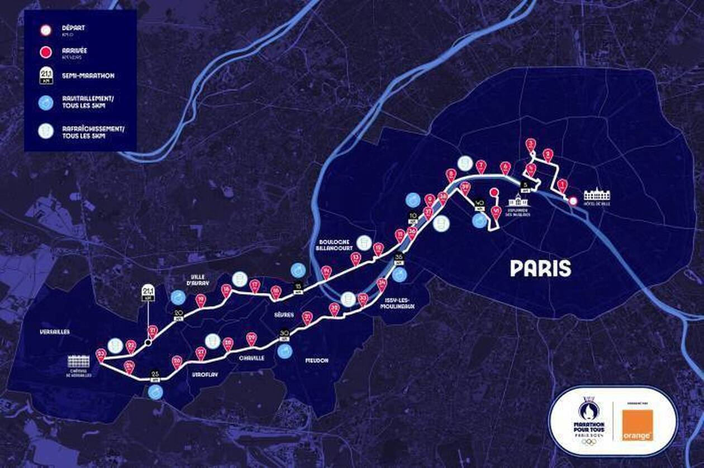
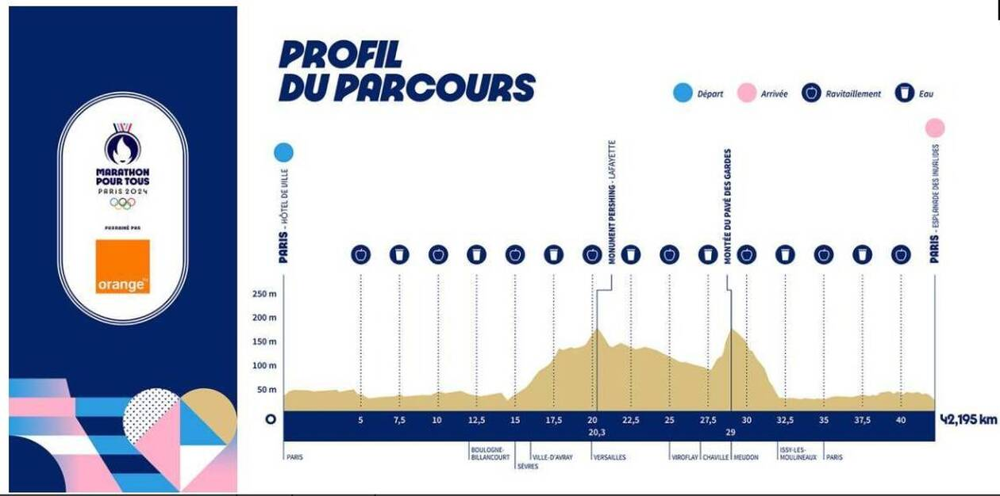
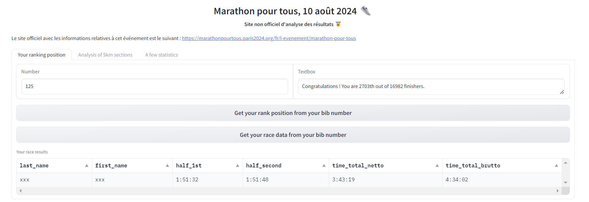
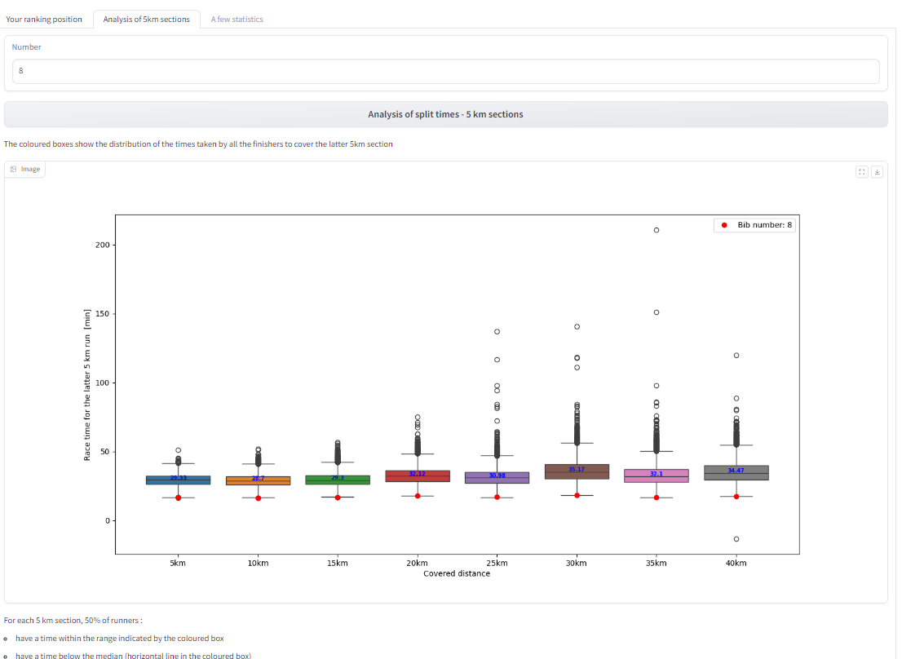
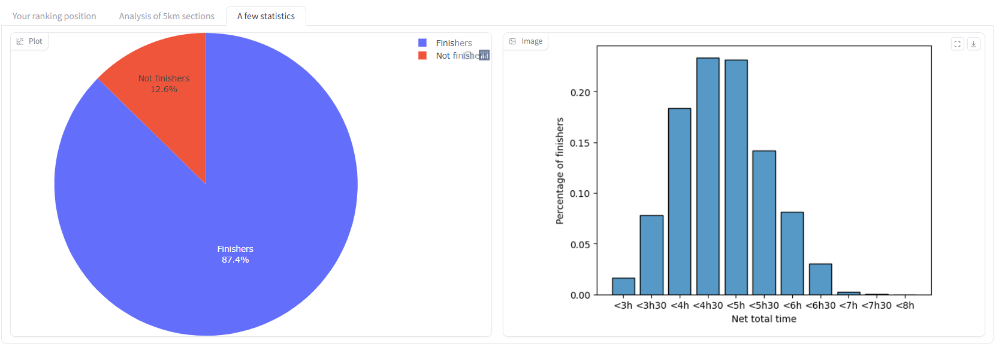

# Analyse des données du marathon pour tous des JO de Paris 2024

**Outils utilisés** Python, BeautifulSoup, Gradio

## Contexte et objectifs
Le samedi 10 août 2024, à 21 heures, des personnes du grand public ont eu la chance de courir sur les traces des athlètes olympiques. Sélectionnées par tirage au sort, elles ont pu parcourir les 42,195 kilomètres du marathon des Jeux Olympiques, atypique par son tracé et son ambiance. Le tracé de ce marathon est chargé d’histoire puisqu’il s’inspire de la Marche des Femmes d’octobre 1789, et se termine donc au château de Versailles, endroit où se sont arrêtées les manifestantes en 1789. Il est également atypique par son profil, puisqu'il accuse un dénivelé positif de 436 mètres, en autant en négatif. Le président du comité d’organisation Tony Estanguet lors de l’annonce du parcours a commenté : « On a voulu casser les codes mais les athlètes nous ont dit : “vous allez surtout nous casser les pattes” ».  

  
   

L'objectif de ce projet est de récupérer les données recueillies par les puces électroniques que portaient les participants sur le site officiel du marathon, et  de leur fournir un récapitulatif de leurs résultats (classement, temps intermédiaires) à partir de leur numéro de dossard.

## Actions réalisées
**Récupération et nettoyage des données**  
Les données ont été récupérées par **web scraping** à l'aide de la librairie Beautiful Soup. Un travail de nettoyage et d'*anonymisation* des données a ensuite été effectué. Enfin, un tri a été nécessaire pour permettre le classement des coureurs. 

**Analyse comparative des résultats des coureurs**
Des statistiques sont réalisées sur les arrivants (finishers). Des boîtes à moustaches sont tracées pour visualiser la distribution des temps mis pour parcourir les distances successives de 5 kilomètres. 

**Création d'une interface avec gradio**  
L'interface est conçue en 3 onglets :  
* un onglet où le participant peut, à partir de son numéro de dossard, accéder à son rang, ainsi qu'aux temps intermédiaires qui ont été enregistrés par sa puce,  
* un onglet où ils peuvent se positionner par rapport aux autres coureurs sur toutes les sections de 5 km,  
* un onglet où ils ont quelques informations statistiques générales sur la course. 

## Résultats  
16982 coureurs sont finishers de cette course, soit 87,4% des partants.  
51% des coureurs ont mis moins de 4h30.   
Chaque participant a accès aux informations le concernant :  

  
   
   

